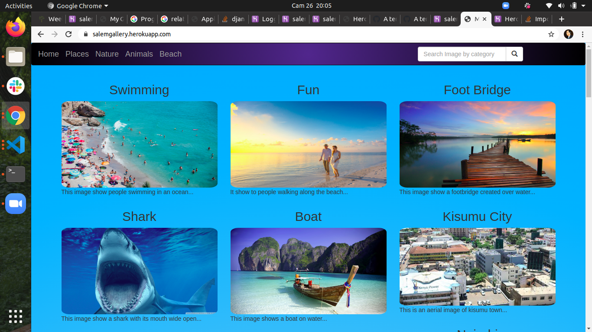

## MY-GALLERY
This is a web based app where one can view different photos and a description of these images.
## Description

The Gallery web has different categories with different locations where the photos were shot or taken. 

## Categories
The user can find images bay:
1. Places
2. Beach
3. Animals
4. Nature
 

 ## BDD
|Behavior 	           |Input 	                     |
Output                         |
| ------------------- | ----------------------------- | 
 ----------------------------- |
|Hover |	Hover the cusor over the image |	The image enlarges on click to show the details |
eg. name, description and the location shot
|Search |	Search image by category |	Takes you to the page where the images by category are located

 # Live link
https://salemgallery.herokuapp.com/

## Set-up and Installation

# Prerequsites

- Python 3.8
- Ubuntu software
- Django
 # Clone the Repo

Run the following command on the terminal:  git clone https://github.com/saa-lem/my-gallery.git

# Install Posgresl 
Run the following command on the terminal:
1. sudo apt-get update
2. sudo apt-get install postgresql postgresql-contrib libpq-dev
3. sudo -u postgres createdb $USER
4.  **N/B: Replace ($USER) with a your username**
5. pqls 
     **to connect to your database**
# Create a Virtual Environment
Run the following commands:
1. python3.6 -m venv --without-pip virtual
2. source virtual/bin/activate
3. curl https://bootstrap.pypa.io/get-pip.py | python
# Install dependancies
1. pip install pillow
2. pip install django-bootsrap3
3. pip install django
4. pip install psycopg2-binary  

# Initiating the dependencies
Run this command in the terminal: 
- pip freeze > requirements.txt
# Deployment
For deployment  follow this documentation: https://gist.github.com/newtonkiragu/42f2500e56d9c2375a087233587eddd0
 # Connecting to the server
In the same terminal type: 
- python3 manage.py runserver
- Open the browser on http://localhost:8000/

 # Server Display
 You should be able to see something like this in the server:
 
# Known bugs
None so far but I'll be glad to be communicated to if there is one

# Technologies used

- Python 3.8
- HTML
- Bootstrap 
- Animate CSS
- Heroku
- Django2
- Postgresql

# Support and contact details

Contact me on salemowino18@gmail.com for any comments, reviews or advice.
# License

Copyright (c) salem